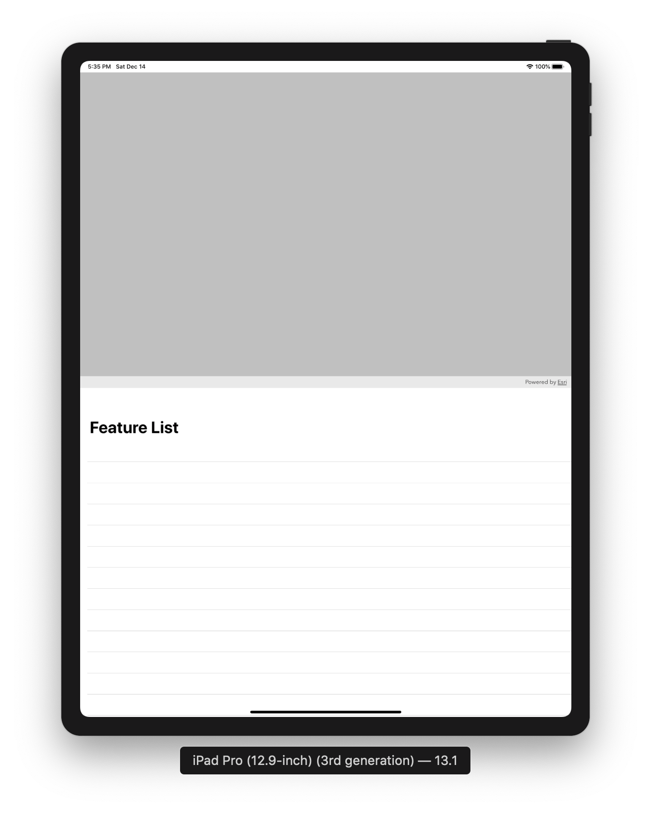
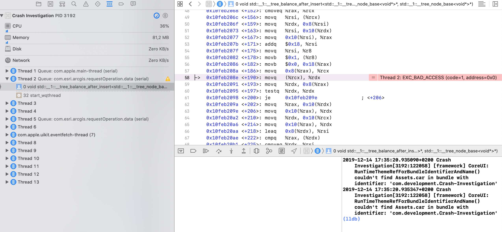

# Crash-Investigation

The app is for demo purpose only. It's crashing from time to time during loading feature layers from the map. Main purpose of the app is to find the problem which leads to crash.

## Get Started
Before building the project be sure you have installed [CocoaPods](https://cocoapods.org) on your local machine and run in Terminal:
1. `cd` into into the cloned repository's directory
2. `pod repo update`
3. `pod install`

## Requirements
* [Xcode 11 and Swift 5](https://itunes.apple.com/us/app/xcode/id497799835?mt=12)
* [ArcGIS Runtime SDK for iOS](https://developers.arcgis.com/ios/) (Project is configured to use CocoaPods distributed ArcGIS SDK v 100.6)

## Steps to reproduce crash
1. Launch the application on Simulator or device. iPad is preffered.
2. Log in to the app with your ArcGIS account.
3. Kill the app.
4. Launch and kill the app for several times in order to get it crashed. It happens without any additional inputs form the user. List of Feature layers just doesn't load correctly. Screenshots:

